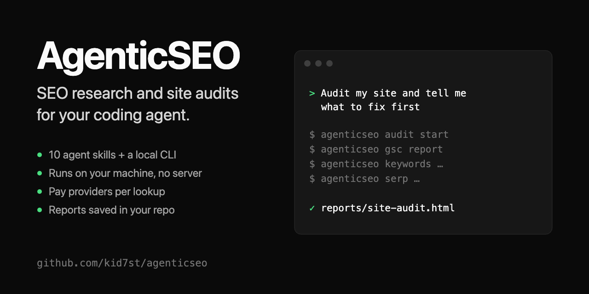

<p align="center">
  
</p>

<p align="center">
  <a href="https://github.com/kid7st/agenticseo/releases/latest"></a>
  <a href="https://github.com/kid7st/agenticseo/actions/workflows/ci.yml"></a>
  <a href="LICENSE"></a>
  
</p>

# AgenticSEO

**SEO research and site audits for your coding agent.**

AgenticSEO gives an agent such as Pi or Claude Code a command-line toolkit and ten ready-made SEO workflows ([Agent Skills](https://agentskills.io)). Ask it to audit your site, find keywords worth targeting, study a competitor or check your Google Maps visibility. It gathers the data, explains what matters, and saves a report in your project.

- **Local.** Runs on your machine. No account, no server, no MCP connection.
- **Pay per lookup.** You pay data providers directly, usually a few cents per lookup. Site audits are free.
- **Evidence you keep.** Every paid result reports its cost and saves the raw data in your website's folder.

AgenticSEO brings the SEO features of [OpenSEO](https://github.com/every-app/open-seo) to local commands and agent skills. It is an independent project, not an official OpenSEO release.

## Quick start

Requires [Node.js](https://nodejs.org) 24.14 or newer.

**1. Install the CLI.** Run the same command again to update.

```sh
npm install -g https://github.com/kid7st/agenticseo/releases/latest/download/agenticseo.tgz
```

**2. Add the skills to your agent.** The [skills](https://github.com/vercel-labs/skills) installer asks which agents to add them to (Pi, Claude Code, Codex, Cursor and many more). Run it again after updating the CLI.

```sh
npx skills add "$(npm root -g)/agenticseo" -g
```

**3. Add a [DataForSEO](https://dataforseo.com) key** to your shell. It is your DataForSEO `login:password` in base64:

```sh
export DATAFORSEO_API_KEY="$(printf 'you@example.com:your-api-password' | base64)"
```

**4. Open your agent in your website's folder and ask:**

> Set up SEO for this site.

The `seo-project-setup` skill asks about your business, goals and competitors, and connects Google Search Console if you want. Not sure what to do next? Ask for the `seo-coach`.

So far AgenticSEO has been tested with Pi. If you use another agent, please [tell us how it went](https://github.com/kid7st/agenticseo/issues).

## What you can ask

| Ask your agent to… | Skill | Cost in our tests |
| --- | --- | --- |
| Audit my site and tell me what to fix first | `seo-audit` | $0.17 (the crawl is free) |
| Find keywords worth targeting for these topics | `keyword-research` | under $0.30 |
| Group my keywords and map them to pages | `keyword-clustering` | $0.05 |
| Analyze this competitor | `competitor-analysis` | $0.20 |
| Show who wins my search market and where the openings are | `competitive-landscape` | $0.65 |
| Check how I show up on Google Maps | `local-seo` | $0.13 |
| Find sites that might link to my guide | `link-prospecting` | $0.19 |

Each workflow ends with a report: a Markdown file your agent can read later and an HTML page you can open, share or print. Costs are what DataForSEO charged in one test run; you can set a budget in your request ("keep it under $0.50"). See [skills](docs/skills.md) for details.

The CLI also tracks keyword rankings on demand or on a schedule, and shows your own Search Console and Analytics data for free.

## How it works

```
 you ──ask──▶ your agent ──reads──▶ skill (the workflow)
                  │
                  └──runs──▶ agenticseo CLI ──▶ DataForSEO · Google Search Console · Analytics · local crawler
                                   │
                                   └──▶ .agenticseo/  results, raw evidence, reports
```

Skills tell the agent what to ask you, which commands to run and how to read the results. The CLI does the data work and prints JSON. For example, `agenticseo keywords "seo audit" "seo audit tool"` returns:

```json
{
  "provider": "DataForSEO",
  "market": { "locationCode": 2840, "languageCode": "en" },
  "rows": [
    { "keyword": "seo audit", "searchVolume": 4400, "cpc": 16.06, "keywordDifficulty": 77, "intent": "commercial" },
    { "keyword": "seo audit tool", "searchVolume": 2400, "cpc": 23.77, "keywordDifficulty": 77, "intent": "commercial" }
  ],
  "costUsd": 0.01224,
  "evidence": ".agenticseo/evidence/2026-09-25T03-30-58.479Z-….json"
}
```

A metric the provider does not have is `null`, never 0. You can run every command yourself; the [command reference](docs/commands.md) covers them all.

## Accounts and costs

| Service | Needed for | Cost |
| --- | --- | --- |
| [DataForSEO](https://dataforseo.com) | Keywords, SERPs, competitors, backlinks, local SEO, AI visibility, rank tracking, Lighthouse | Pay per lookup, usually $0.001–$0.08; an AI brand lookup is about $0.60–$0.85 |
| Google Search Console and Analytics | Your site's own clicks, queries and visitor behavior | Free; needs a one-time [Google setup](docs/google.md) |
| [Ahrefs](https://ahrefs.com) (optional) | Ahrefs Domain Rating | Free API key |

Keys live in your environment and never go into project files. Repeated lookups come from a local cache and cost nothing.

## Where your data lives

Everything for a site stays in a `.agenticseo/` folder inside it:

| Path | What it holds | In Git? |
| --- | --- | --- |
| `project.json` | Domain, market, and which Search Console and Analytics property to use | Your choice |
| `context.json` | What your agent knows about the business: goals, positioning, competitors, key pages and a research log | Your choice |
| `reports/` | Finished reports (Markdown and HTML) | Your choice |
| `exports/` | CSV and JSON exports | Your choice |
| `evidence/` | The raw provider response behind every paid result | Ignored |
| `data/` | A SQLite database of saved keywords, audits and ranking history | Ignored |
| `cache/` | Cached lookups | Ignored |

Google access tokens are stored per user in `~/.config/agenticseo/`, never in a project. Behind a proxy, set `HTTPS_PROXY` as you would for curl.

## Documentation

- [Skills](docs/skills.md): the ten workflows, how to install them and how reports work
- [Command reference](docs/commands.md): every command, option and exit code
- [Google Search Console and Analytics setup](docs/google.md)
- [Contributing](CONTRIBUTING.md), [design](docs/DESIGN.md), [OpenSEO parity](docs/openseo-parity.md) and [security](SECURITY.md)

## License

MIT. AgenticSEO includes source adapted from OpenSEO (MIT, Copyright (c) 2026 Ben Senescu). Each adapted file names its origin, and OpenSEO's notice is kept in [LICENSES/OpenSEO.txt](LICENSES/OpenSEO.txt). AgenticSEO is not affiliated with OpenSEO's maintainers.
